# E-Ride Services - Eco-friendly E-Bike Rental Platform


**E-Ride Services** is a web-based platform designed to provide a smart, affordable, and eco-friendly transportation solution using e-bikes and scooters. This application targets students and office workers in urban areas like **Bashundhara R/A, Dhaka**. 

The system allows users to rent electric vehicles from designated stations, track their ride time, and pay a transparent fare (**2 Taka per minute with a minimum charge of 3 Taka**). The platform is managed through a centralized web interface with three distinct roles: **Rider (Customer), Manager, and System Admin**.

---

## 📖 Background Study
In fast-growing cities like Dhaka, students, office workers, and ordinary people struggle daily to find good transportation. Current options are often too expensive, unreliable, and harmful to the environment. While global e-ride services like Lime, Bird, and Tier are popular, Bangladesh still lacks a proper technology-based system for this. 

E-Ride Services solves this by offering a self-driven, short-distance (last-mile connectivity) rental service. Unlike traditional car rentals, it does not require lengthy paperwork, security deposits, or a heavy vehicle license. It is quick, simple, and designed for the modern commuter.

---

## 👥 Team Members
| SL | Student ID | Name | Role |
| :---: | :---: | :--- | :--- |
| 1 | 23-55285-3 | MD. SHIFUL ISLAM | Member |
| 2 | 23-55311-3 | ANJAN SARKER | Member |
| 3 | 23-55198-3 | TAMAL SUTRADHAR | Member |


---

## ✨ Key Features

### 🔐 Common Features (All Users)
*   **Authentication & Security:** Secure Registration, Login, Logout, Session Management, and Role-based Access Control (RBAC).
*   **Profile Management:** View, Edit, Update Profile, Change Password, and Delete Account (Customer).
*   **Dashboard:** Personalized dashboards for Customers, Managers, and Admins.

### 👤 Customer Features
*   **Bike Discovery & Booking:** View available E-Bikes, bike types, details, select pickup station, and book/cancel bookings.
*   **Ride Management:** Start a ride (with or without prior booking), select end station, complete ride, and track ride history.
*   **Automated Calculations:** Automatic Ride Fare and Duration calculation based on time.
*   **Payments:** Secure checkout with Card or bKash, Transaction ID generation, and payment status tracking.

### 👨‍💼 Manager Features
*   **Station Operations:** View and update assigned station information, monitor station capacity, and real-time availability.
*   **Vehicle/Fleet Management:** Add, edit, delete, and change vehicle status (Available, Booked, In-Ride, Maintenance).
*   **Fleet Logistics:** Transfer/move vehicles from one station to another seamlessly.

### 🛡️ Admin Features
*   **User & Role Management:** View all users, delete accounts, and change roles (Customer, Manager, Admin).
*   **Request Management:** Review, approve, or reject Manager role requests.
*   **System & Station Management:** Add, edit, or deactivate stations, and assign managers to specific stations.
*   **Financial Monitoring:** View payments, monitor transactions, and update transaction statuses.

---

## 🗄️ System Design & Architecture

### Database ER Diagram
> 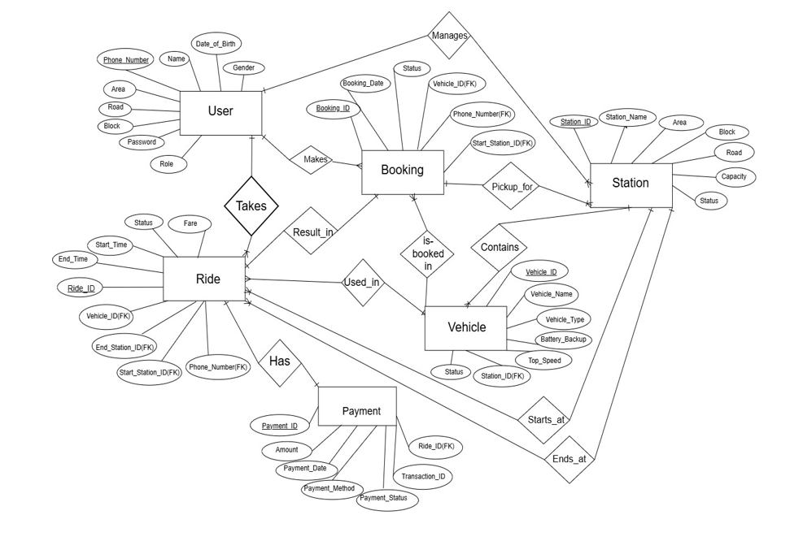

### UI/UX Design (Use Case Diagram)
> 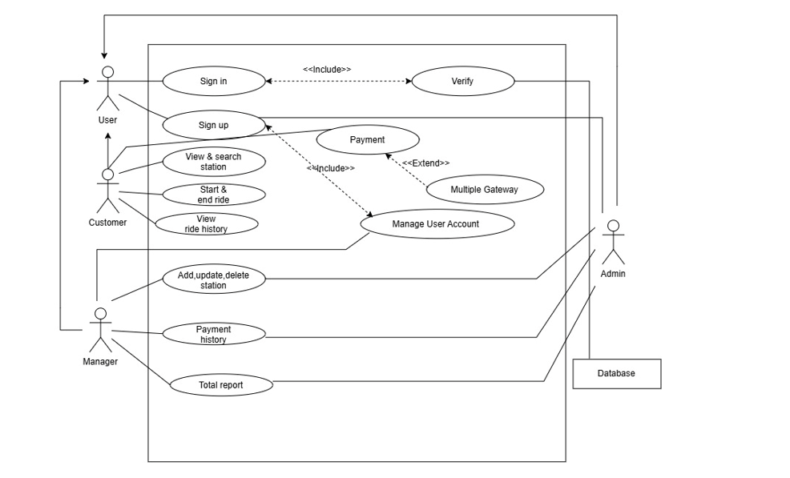

---

## 📸 Screenshots

### 🔐 Authentication
| Landing Page | Login | Registration |
| :---: | :---: | :---: |
| 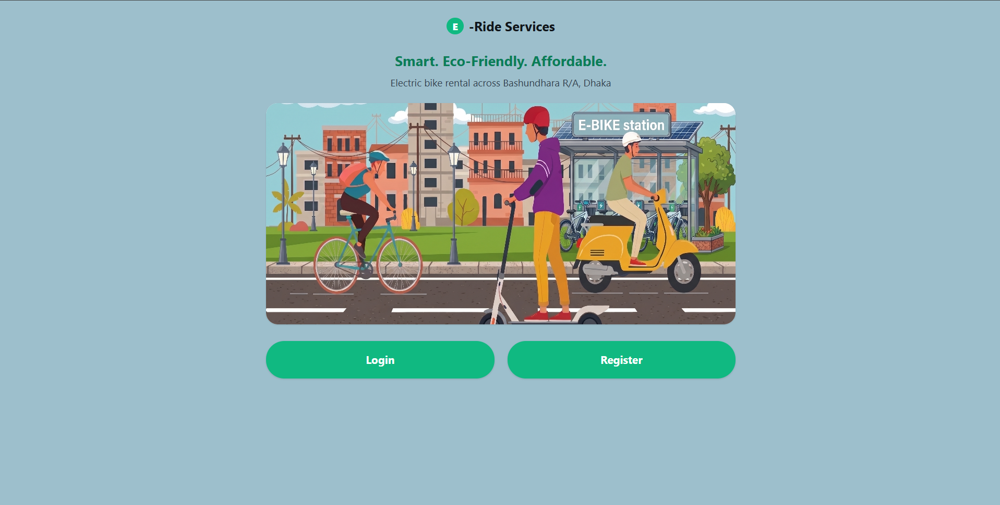 | 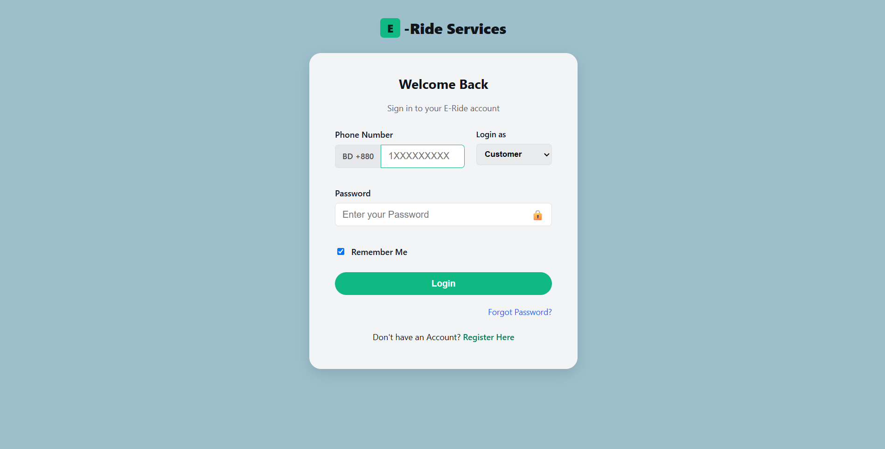 | 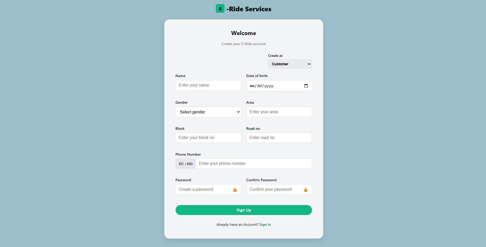 |

### 👤 Customer Panel
<details>
<summary><b>Click to expand Customer Panel Screenshots</b></summary>
<br>

| Customer Dashboard | Profile & Settings | Rent a Bike |
| :---: | :---: | :---: |
| 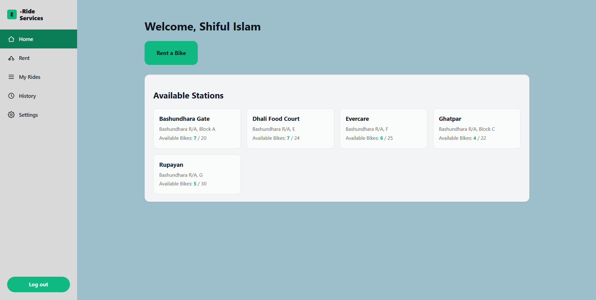 | 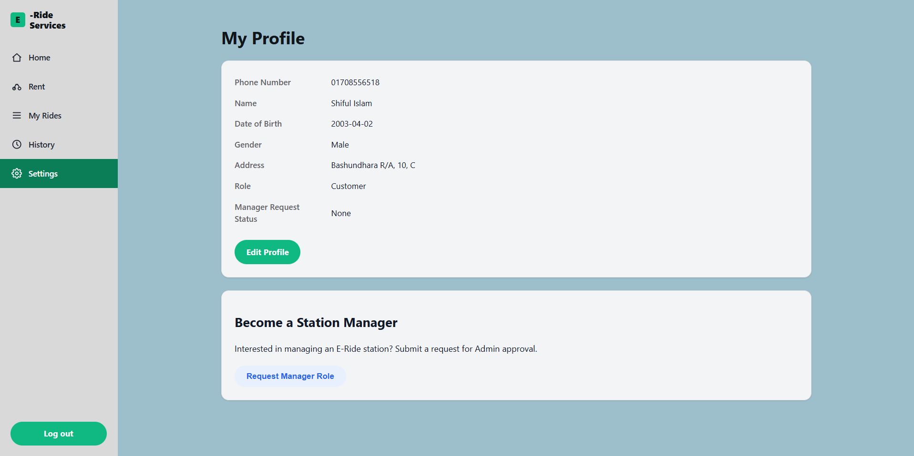 | 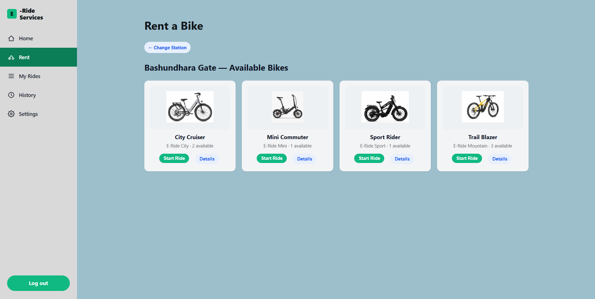 |

| Manage Ride | Payment Checkout |
| :---: | :---: |
| 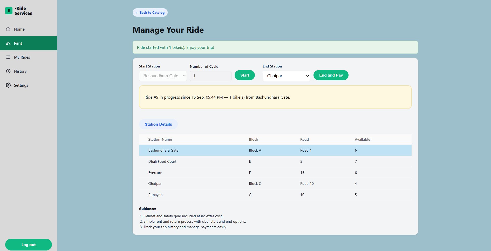 | 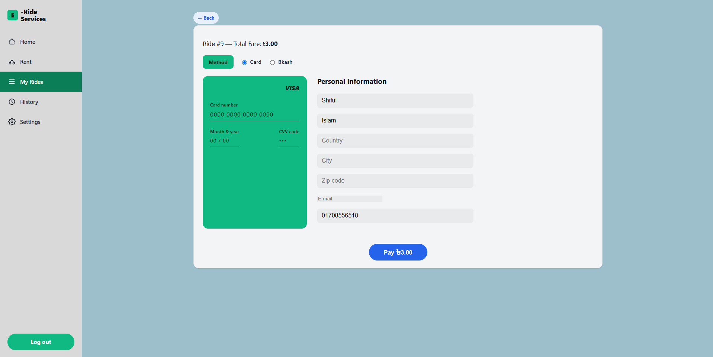 |

</details>

### 👨‍💼 Manager Panel
<details>
<summary><b>Click to expand Manager Panel Screenshots</b></summary>
<br>

| Manager Dashboard | Manage Bikes |
| :---: | :---: |
| 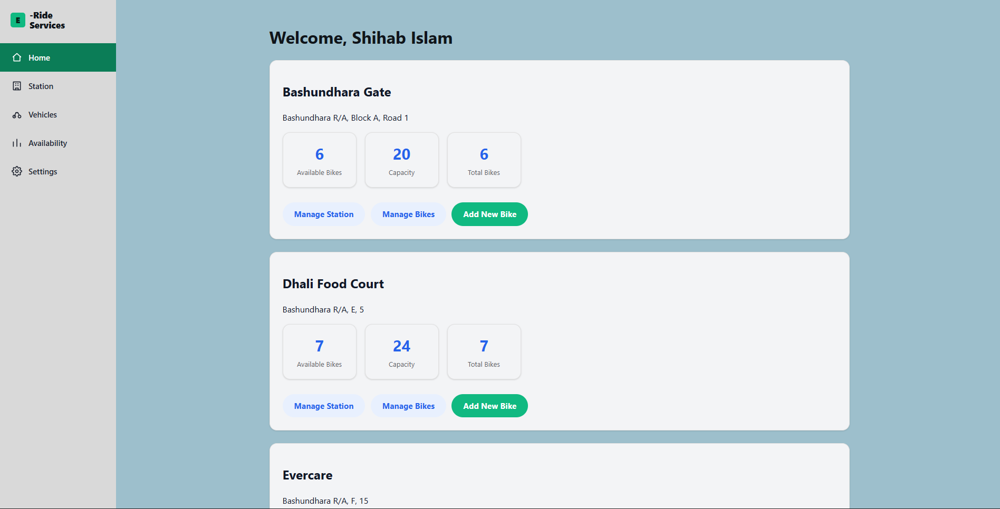 | 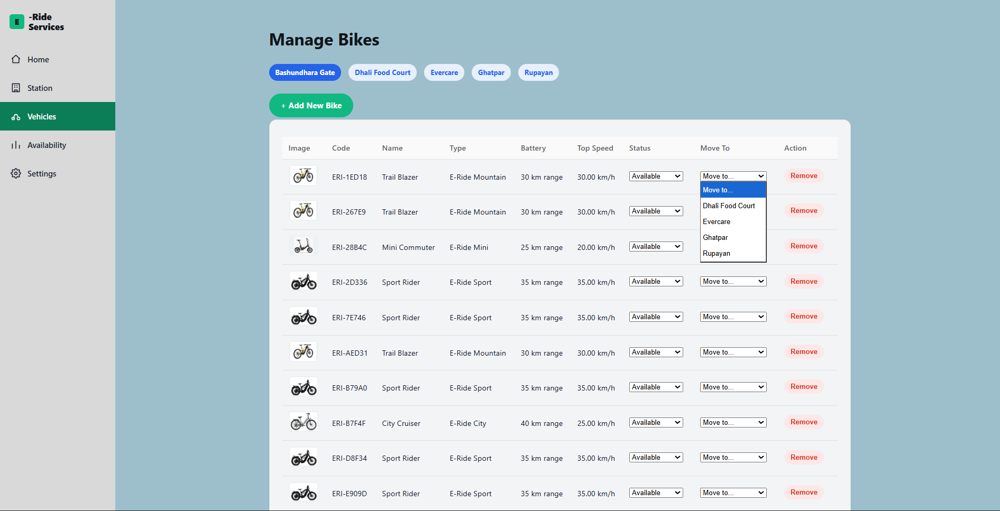 |

</details>

### 🛡️ Admin Panel
<details>
<summary><b>Click to expand Admin Panel Screenshots</b></summary>
<br>

| Admin Dashboard | Manage Users | Manager Requests |
| :---: | :---: | :---: |
| 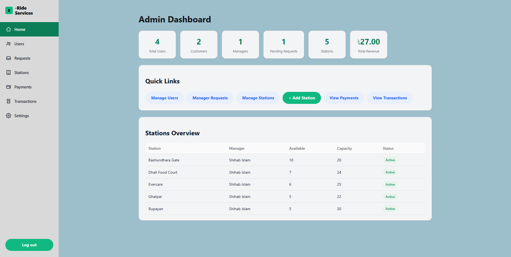 | 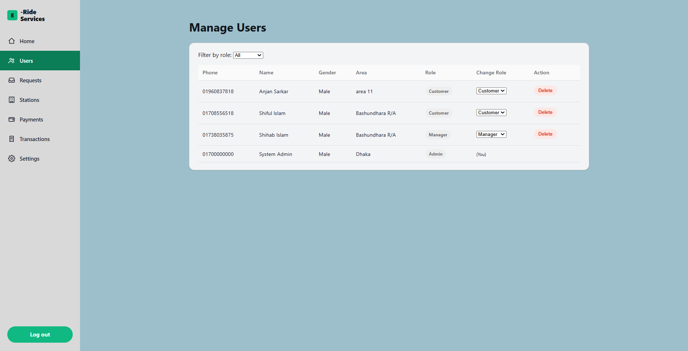 | 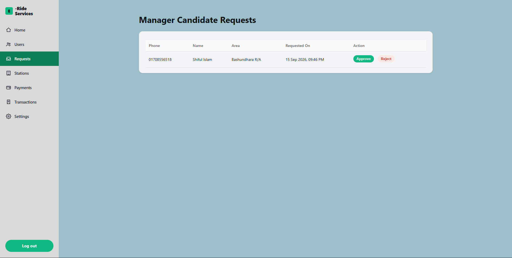 |

| Manage Stations | Payments Overview |
| :---: | :---: |
| 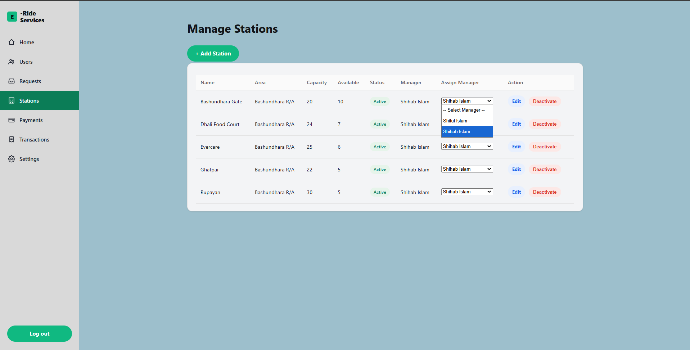 | 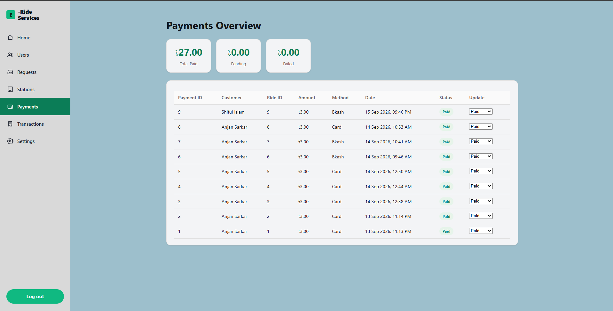 |

</details>

---

## 🛠️ Technologies Used
*   **Frontend:** HTML, CSS, JavaScript
*   **Backend:** PHP
*   **Database:** MySQL
*   **Local Server:** XAMPP
*   **Version Control:** Git & GitHub

---

## 🚀 How to Run Locally

1. **Clone the repository:**
   ```bash
   git clone https://github.com/ShifulIslam03/ERide-web.git
